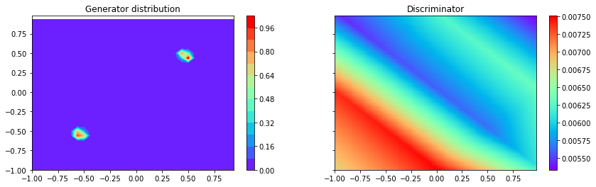

# Visualizing the learning procedure of GANs.

For various GAN implementations, one can see throughout learning the probability density function of the Generator and the values of the Discriminator fitted to a 2-D gaussian mixture.

