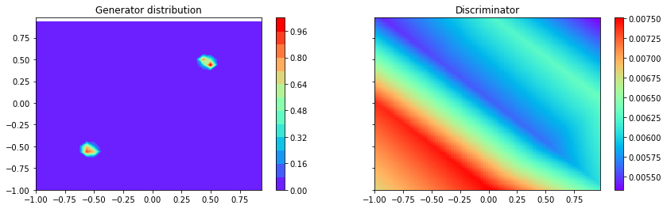

# Research on Generative Adversarial Networks

This Git Repository is the result of a research work made at NYU with Emily Denton and Rob Fergus on Generative Adversarial Networks.

# Goal

Our project's goal is :
* understand the learning procedure of GANs with simple Gaussian mixtures - directory GaussianMixture.
* Comparing common metrics on GAN's against our classifier metric. (Note: We don't use the Inception score as this metric is not about distribution distance).

Our classifier metric consists of :
1. Learn a generator G(z,c) on latent noise z and class c, conditional learning using Auxiliary Classifier GAN.
2. Learn a classifier f on generated samples. The classifier classifies generated images into their class.
3. Look at the accuracy of f on a test set.

This method will tell us about the diversity of the learned distribution and thus how close the learned Generator G is from the true image distribution.

# Implementations :

* Implements several Generative Adversarial Networks architectures :
  * Deep Convolutionnal GAN (https://arxiv.org/pdf/1511.06434.pdf)
  * Wasserstein GAN (https://arxiv.org/pdf/1701.07875.pdf)
  * Auxiliary Classifier GAN (https://arxiv.org/pdf/1610.09585.pdf)
  * InfoGAN (https://arxiv.org/pdf/1606.03657.pdf)
  * Energy-based Generative Adversarial Network (https://arxiv.org/pdf/1609.03126.pdf)
  * BEGAN: Boundary Equilibrium Generative Adversarial Networks (https://arxiv.org/pdf/1703.10717.pdf)

### ClassifierGAN :

* main.py : Train a conditional GAN following AC-GAN guidelines.
* classify.py : Learn a simple convnet on generated samples and evaluate its accuracy on a test set.

### models :

Different Generator / Discriminator (w/ and w/o conditionning) / Classifiers architectures. Example architectures : DC-GAN, resnet, ...

### GaussianMixture :

Fit a GAN to a simple Gaussian mixture, plotting the surface value of the Discriminator and the probability density function of the generator throughout learning.

Implemented papers :
* DC-GAN.
* Wasserstein GAN.
* Wasserstein GAN with gradient penalty.

### Scripts:

Scripts for launching jobs on the cluster.
